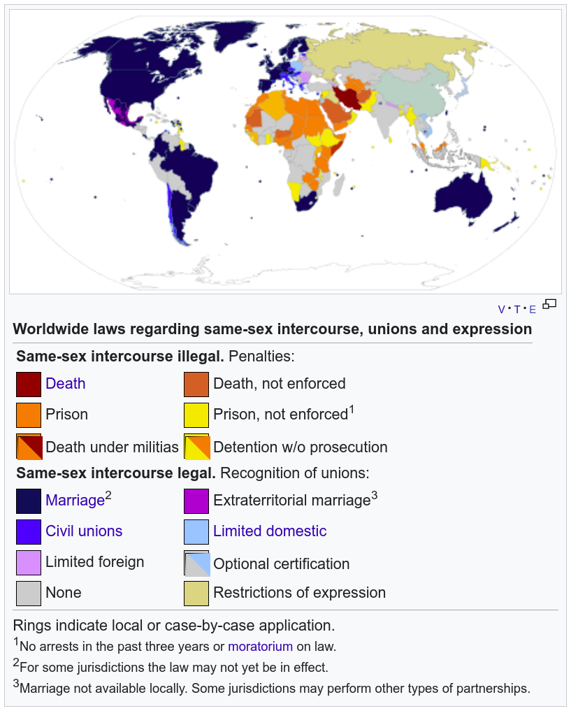

## Keywords

- free zone
- same sex marriage
- adoption rights
- equality
- oppression
- acceptance
- minority
- rainbow (pride flag)
- stereotypes

## Art Attack - Same Love

Lyrics

| [Intro]
| This song is dedicated to the New Slaves, the New Blacks, the New Jews,
| the New Minorities for whom we need a civil rights movement, maybe a sex rights
| movement. Especially in Africa. Everywhere this goes out to you. I feel you.
| This is my story yo, my sorry story yo, this is me, this is you, this is us,
| this is the World, World war, Wild war, cold war, love war…
|
| [Verse One]
| Years back I fell in love with a male kid in school
| He was cool he was funny, always true always shining
| My heart told me I was right I could go ahead and love him I could go ahead and have him
| I could go ahead and hug him
| He was never judgmental always stood by side
| Always there when I called him, showed support when am falling
| We spent all the days together, every weekend sharing stories
| Summer winter every weather life was full of all glories
| In his eyes there was a sparkle
| And my heart was spinning circles and one day I went and told him that I thought I was a psycho cause I was in love with a boy like me
| And I told him no one ever gave me joy like me
| So he came close, stretched arms and hugged me tight
| And he told me never leave me please love me right
| It was strange cause I was a man just like him
| I really couldn’t explain it but I just liked him…
| I did… Uh… Yeah….
|
| [Chorus]
| And I can’t change
| Even if I tried
| Even if I wanted to
| And I can’t change
| Even if I tried
| Even if I wanted to
| My love, my love, my love
| She keeps me warm (4x)
|
| [Verse Two]
| Years later I told Mummy what I was going thru
| I told her I loved a bit and he loved me too
| Mommy started cursing me running to daddy
| And told Daddy our son’s gone crazy already
| A decision was arrived to, you’re not our son
| Pack your bags shameless heathen and follow the sun
| I sank down to my knees tryna call out to Mama
| Mummy said I ain’t you Mummy you the son of the Devil
| and Daddy said go fool ‘fore I strangle you devil
| and for the last six years my parents have never seen me
| You May Like :   You will ‘Like This’ Toludadi featuring Cici Yeaboah Track Celebrating Black Women
| everyday I bleed tears hoping that they wish to see me
| and I,avoid the public cause I am scared of the jail
| coz if they ever caught me they would throw me in jail
| you’re a criminal how dare you, falling in love it’s a crime to follow your heart and follow your love
| I’m breaking the Constitution going thru segregation
| Africanization, power to the black nation
| Church rules, street rules
| Court rules, school rules
| Hate is the new love,kill maim talk tough
| Homophobia is the new African culture
| Everyone’s the police,Everyone’s a Court judge,mob law,street justice
| Kill em when you see em
| Blame it on the West never blame it on Love, it’s un-African to try and show a brother some love
|
| [Chorus]
|
| Shout out to my brothers Binyavanga Joji Baro
| And my lele sisters everywhere in the struggle
| Never love from society
| The hate is too much all in the name of piety
| Uganda stand strong Nigeria Africa,it’s time for new laws,not time for new wars
| We come from the same God,cut from the same cord,share the same pain and share the same skin
| The March is still on,Luther spirit lives on
| It’s a bedroom struggle and also a street struggle
| Judge less and love more/stand up and stand tall,talk tough or talk not
| We gon Love and love more yo…
|
| [Chorus]
|
| [Outro]
| Love is patient
| Love is kind
| Love is selfless
| Love is faithful
| Love is full of hope
| Love is full of trust
| Love is not proud
| Love is God and God is Love
| According to the words of Loretta Young, ‘Love is not something you find. Love is something that finds you’.

Consequences of being found out:

- Jail
- Exclusion from society

## Macklemore & Ryan Lewis - Same Love

Lyrics

| [Piano Intro]
|
| [Verse 1: Macklemore]
| When I was in the third grade, I thought that I was gay
| ‘Cause I could draw, my uncle was, and I kept my room straight
| I told my mom, tears rushing down my face
| She's like, "Ben, you've loved girls since before Pre-K!"
| Trippin', yeah I guess she had a point, didn't she?
| A bunch of stereotypes all in my head
| I remember doing the math like, "Yeah, I'm good at little league."
| A pre-conceived idea of what it all meant
| For those that like the same sex had the characteristics
| The right-wing conservatives think it's a decision
| And you can be cured with some treatment and religion
| Man-made, rewiring of a pre-disposition
| Playing God, aw nah, here we go
| America the brave still fears what we don't know
| And "God loves all his children" is somehow forgotten
| But we paraphrase a book written thirty-five hundred years ago
| I don't know
|
| [Hook: Mary Lambert]
| And I can't change, even if I tried
| Even if I wanted to
| And I can't change, even if I tried
| Even if I wanted to
| My love, my love, my love
| She keeps me warm
| She keeps me warm
| She keeps me warm
| She keeps me warm
| [Verse 2: Macklemore]
| If I was gay, I would think hip-hop hates me
| Have you read the YouTube comments lately?
| "Man, that's gay" gets dropped on the daily
| We've become so numb to what we're sayin'
| Our culture founded from oppression
| Yet we don't have acceptance for 'em
| Call each other faggots behind the keys of a message board
| A word rooted in hate, yet our genre still ignores it
| "Gay" is synonymous with the lesser
| It's the same hate that's caused wars from religion
| Gender to skin color, the complexion of your pigment
| The same fight that led people to walk-outs and sit-ins
| It's human rights for everybody, there is no difference
| Live on and be yourself
| When I was at church they taught me something else
| If you preach hate at the service, those words aren't anointed
| That holy water that you soak in has been poisoned
| When everyone else is more comfortable remaining voiceless
| Rather than fighting for humans that have had their rights stolen
| I might not be the same, but that's not important
| No freedom 'til we're equal, damn right I support it
|
| [Trombone Interlude]
|
| [Hook: Mary Lambert]
| And I can't change, even if I tried
| Even if I wanted to
| My love, my love, my love
| She keeps me warm
| She keeps me warm
| She keeps me warm
| She keeps me warm
| [Verse 3: Macklemore]
| We press play, don't press pause: progress, march on!
| With a veil over our eyes, we turn our back on the cause
| 'Til the day that my uncles can be united by law
| Kids are walking 'round the hallway
| Plagued by a pain in their heart
| A world so hateful, some would rather die than be who they are
| And a certificate on paper isn't gonna solve it all
| But it's a damn good place to start
| No law's gonna change us, we have to change us
| Whatever god you believe in, we come from the same one
| Strip away the fear, underneath it's all the same love
| About time that we raised up!
|
| [Hook: Mary Lambert]
| And I can't change, even if I tried
| Even if I wanted to
| And I can't change, even if I tried
| Even if I wanted to
| My love, my love, my love
| She keeps me warm
| She keeps me warm
| She keeps me warm
| She keeps me warm
|
| [Outro: Mary Lambert]
| Love is patient
| Love is kind
| Love is patient
| Love is kind (not crying on Sundays)
| Love is patient (not crying on Sundays)
| Love is kind (not crying on Sundays)
| Love is patient (not crying on Sundays)
| Love is kind (not crying on Sundays)
| Love is patient (not crying on Sundays)
| Love is kind (not crying on Sundays)
| Love is patient
| Love is kind

## Legal status of same-sex intercourse

## Homophobia

- indirect homophobia
- direct homophobia
- casual homophobia
- silent homophobia

(@) Sophie is watching TV with her dad, and he changes the channel three times
before sighing and saying "These gays are all over the TV nowadays. It's like
they're taking over. I've got no problem with them, but they don't have to shove
it in my face."

indirect homophobia

(@) John, a new student, does not like football and his best friend is a girl.
When he walks past a group of boys, they whisper "poofter", "queer" and "gay
boy". Suzanne, John's best friend, is with him when the boys are whispering
these insults. She feels embarrassed for John and so she pretends it hasn't
happened.

direct homophobia for the boys and silent for the girl

(@) Steven's mum has bought a new Smart Car. Steven's friend laughs when he sees
it and says "I can't believe she bought that. Smart Cars are like the gayest
cars you can get."

casual homophobia
