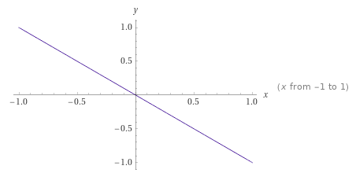

## Merksatz

Eine Schwingung heißt harmonisch, wenn

(1) $x(t) = \hat{x} \cdot \sin(\omega t)$
(2) Die Rückstellkraft ist proportional zur Auslenkung

## Beweis, dass aus 1. 2. folgt

$$
\begin{aligned}
    x(t) &= &\hat{x} \sin(\omega t) \\
    v(t) = \dot{x}(t) &= \omega &\hat{x} \cos(\omega t) \\
    a(t) = \ddot{x}(t) &= -\omega^2 &\hat{x} \sin(\omega t) \\
\end{aligned}
$$

Grundgesetz der Mechanik $F = ma$

$a(t)$ bei $F = ma$ einsetzen

$F(t) = -m\omega^2 \hat{x} \sin(\omega t)$

$\hat{x} \sin(\omega t)$ ist $x(t)$

$F(t) = -m\omega^2 x(t)$

Also ist die Kraft proportional zur Auslenkung.



Positive Auslenkung $\rightarrow$ negative Kraft, deshalb heißt die Kraft Rückstellkraft.

## Beweis, dass aus 2. 1. folgt.

Modellsystem Federbeschleuniger

```txt
Auf Zug und Druck belastbare Feder
     |   Masse m
     |   |
     v   v

\|wwwwww[ ]
--------------------
   ______|____________________> x
         0
```

Es gibt keine Reibung!

Es gilt das Hooksche Gesetz $F = -Dx$

$F(t) = -Dx(t)$

Grundgesetz der Mechanik $F = ma = m\ddot{x}(t)$

Gleichsetzen beider Formeln fpr $F(t)$

$$
\begin{aligned}
    -Dx(t) &= m\ddot{x}(t) \qquad | :(-D) \\
    x(t) &= -\frac{m}{D}\ddot{x}(t)
\end{aligned}
\rightarrow \text{Differentialgleichung}
$$

Differentialgleichung einer harmonischen Schwingung: Gesucht ist eine Funktion!

Gesucht ist eine Funktion die proportional zu ihrer 2. Ableitung ist. Ausprobieren

- $x(t) = 2+t^2$
- $\dot{x}(t) = 2t$
- $\ddot{x}(t) = 2$

2+t^2 ist nicht proportional zu 2

- $x(t) = \hat{x} \sin(\omega t)$
- $\dot{x}(t) = \omega \hat{x} \cos(\omega t)$
- $\ddot{x}(t) = -\omega^2 \hat{x} \sin(\omega t)$

$\hat{x} \sin(\omega t)$ ist proportional zur 2. Ableitung!

Einsetzen von $x(t) = \hat{x} \sin(\omega t)$ in die Differentialgleichung

$$
\begin{aligned}
    x(t) &= -\frac{m}{D}\ddot{x}(t) \\
    \hat{x} \sin(\omega t) &= -\frac{m}{D}(-\omega^2 \hat{x} \sin(\omega t)) \\
    \hat{x} \sin(\omega t) &= \frac{m}{D}\omega^2 \hat{x} \sin(\omega t) &\qquad& | \text{Rechte Seite abziehen} \\
    \hat{x} \sin(\omega t) - \frac{m}{D}\omega^2 \hat{x} \sin(\omega t) &= 0 &\qquad& | \hat{x} \sin(\omega t) \text{ausklammern} \\
    \hat{x} \sin(\omega t) [1 - \frac{m}{D}\omega^2] &= 0
\end{aligned}
$$

Die Gleichung wird für alle Zeiten gelöst, wenn

$$
\begin{aligned}
    1-\frac{m}{D}\omega^2 &= 0 \qquad &|&  +\frac{m}{D}\omega^2 \\
    1 &= \frac{m}{D}\omega^2 \qquad &|& \cdot \frac{D}{m} \\
    \frac{D}{m} &= \omega^2 \qquad &|& \sqrt{} \\
    \sqrt{\frac{D}{m}} &= \omega
\end{aligned}
$$

Die Differentialgleichung wird gelöst $\omega = \sqrt{\frac{D}{m}}$ eingesetzt wird.
