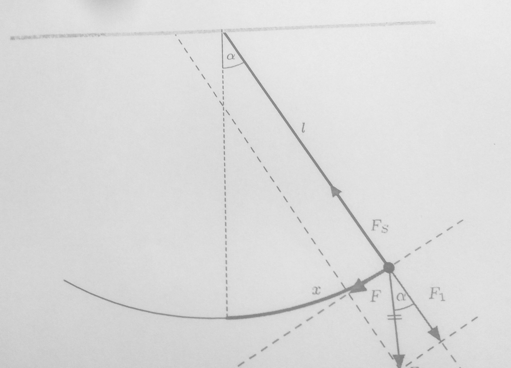

Fadenpendel

: Ein Fadenpendel besteht aus einem Pendelkörper, der an einem Faden aufgehängt
ist. Die Masse des Fadens ist so klein, dass sie gegenüber der Masse des
Pendelkörpers vernachlässigt werden kann. Lenkt man den Pendelkörper aus, so
schwingt der Körper um die Ruhelage.

## Experimentelles Ergebnis

Experimentell haben wir herausgefunden, dass die Schwingungsdauer des
Fadenpendel bei kleinen Auslenkungen auf der Erde allein von der Fadenlänge
bestimmt wird: $T = 2\pi \sqrt{\frac{l}{g}}$

## Vergleich mit der Theorie

Jetzt sollen diese Ergebnisse theoretisch bestätigt werden: Wir zeigen

1. Das Fadenpendel ist ein harmonischer Oszillator
2. $T = 2\pi \sqrt{\frac{l}{g}}$

## Beweis der Harmonie?

(@) Prüfe ob $F = -D \cdot x$ gilt

- Was ist $F$?

    - $F$ liegt tangential an den Kreisbogen.

- Kräftediagramm (minus, da die Kraft der Auslenkung entgegenwirkt)

    - $$
        \begin{aligned}
            \sin(\alpha) = -\frac{F}{F_G} \implies F &=& -F_G \cdot \sin(\alpha) \\
            &=& mg\sin(\alpha)
        \end{aligned}
        $$

- Was ist die Elongation $x$?

    - Bogenlänge von Ruhelage bis Pendelkörper.

- Wir messen $\alpha$ im Bogenmaß

    - $\alpha = \frac{x}{l}$
    - $F = -mg\sin(\frac{x}{l})$
    - **Die Rückstellkraft ist nicht proportional zur Auslenkung**

Kleinwinkelnäherung

: Für kleine Auslenkungen ist $\sin(\frac{x}{l}) \approx \frac{x}{l}$

- Also gilt für kleine Auslenkungen ($x \ll l$)

    - $$
        \begin{aligned}
            F &= -mg\frac{x}{l} \\
            &= -\frac{mg}{l}x \\
            &= -D \cdot x \\
            D &= \frac{mg}{l}
        \end{aligned}
        $$

## Zeige, dass die Schwingungsdauer nur von der Fadenlänge abhängt

$$
\begin{aligned}
    T &= 2\pi\sqrt{\frac{m}{D}} \\
    &= 2\pi\sqrt{\frac{m}{\frac{mg}{l}}} \\
    &= 2\pi\sqrt{m\frac{l}{mg}} \\
    &= 2\pi\sqrt{\frac{l}{g}}
\end{aligned}
$$
